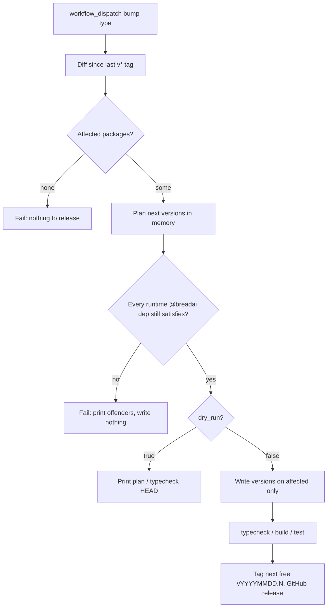

# CLAUDE.md

Internal notes for working on the **bread** monorepo. User-facing docs live in
[`README.md`](./README.md) and [`docs/`](./docs/) — read those first for the public API.

## Workspace commands

```bash
bun install               # install all workspace deps
bun run typecheck         # tsc --noEmit across every package
bun run build             # build every package to its dist/ (bun build + tsc declarations)
bun run test              # bun test
```

All tests run under `bun test`. The shared `BreadStore` contract
(`packages/test-utils/src/store-contract.ts`, `storeContractCases`) is expressed with node:assert
(works fine under Bun) so every store implementation reuses it; Postgres is tested hermetically
against an in-process pglite (no Docker/DB) via `withPglite()`.

Inside an example or app: `bread dev` (hot-reload server), `bread build`, `bread start`,
`bread chat` (interactive REPL, HITL), `bread invoke` (one-shot, no HITL), `bread eval`,
`bread sessions`.

## Package layout

| Package | Dir | Notes |
|---------|-----|-------|
| `@breadai/core` | `packages/core` | Core SDK — runtime, runner, types |
| `@breadai/server` | `packages/server` | Hono server + loader (importable library) |
| `@breadai/cli` | `packages/cli` | `bread` bin; depends on `@breadai/server` |
| `@breadai/test-utils` | `packages/test-utils` | Private test harness (`makeBread`, mock models, `storeContractCases`) — not published |
| `@breadai/otel` | `extensions/otel` | OpenTelemetry plugin |
| `@breadai/store-postgres` | `stores/postgres` | Postgres `BreadStore` (default; optional pgvector) |
| `@breadai/store-sqlite` | `stores/sqlite` | SQLite store via `bun:sqlite` |
| `@breadai/store-memory` | `stores/memory` | In-memory store (tests, ephemeral) |
| `@breadai/store-s3` | `stores/s3` | S3-backed `BlobStore` — binary/file storage via presigned URLs |
| `@breadai/provider-catalog` | `providers/catalog` | The 20 catalog providers as a `ProviderRegistry` |
| `@breadai/protocol-ag-ui` | `protocols/ag-ui` | AG-UI protocol |
| `@breadai/protocol-a2a-server` | `protocols/a2a-server` | Agent-to-agent (A2A) protocol |
| `@breadai/protocol-mcp-client` | `protocols/mcp-client` | Consume MCP servers (config-level + per-agent `cfg.plugins.mcp_client`) |
| `@breadai/protocol-mcp-server` | `protocols/mcp-server` | Expose bread agents/tasks/tools/skills as an MCP server |
| `@breadai/a2ui` | `extensions/a2ui` | A2UI extension |
| `@breadai/auth-api-key` | `extensions/auth-api-key` | API-key auth strategy + signer |
| `@breadai/auth-jwt` | `extensions/auth-jwt` | JWT auth strategy (verification only) |
| `@breadai/auth-oauth2` | `extensions/auth-oauth2` | OAuth2 bearer-token verify + client-credentials signer |
| `@breadai/transport-stdout` | `transports/stdout` | Terminal-rendering `BreadTransport` (`sink`) for `bread chat`/`bread invoke` |
| `@breadai/transport-redis` | `transports/redis` | Redis Streams `BreadTransport` (cross-replica crumb fan-out; no `mount`) |
| `@breadai/transport-http-chunked` | `transports/http-chunked` | HTTP ingress `BreadTransport` (NDJSON) + `remoteAgent()`; recommended default |
| `@breadai/transport-http-sse` | `transports/http-sse` | HTTP ingress `BreadTransport` (SSE) + `remoteAgent()`; browser-`EventSource`-friendly |

## Source-vs-dist resolution (important)

Packages publish `dist/` but the workspace develops against `src/`. This is wired with a
private export condition, **not** `publishConfig` (bun ignores `publishConfig.exports`):

- Each `package.json` `exports` has `"bread-source": "./src/index.ts"` plus `import`/`types` → `dist`.
- `tsconfig.base.json` sets `"customConditions": ["bread-source"]` so `tsc` resolves source — no prebuild needed for typecheck.
- Running workspace code through bun needs `--conditions bread-source` (the cli `dev` script already passes it).
- Published consumers never set that condition, so they resolve `dist`.

Builds use `--packages external` so deps (`ai`, `zod`, `@breadai/core`, …) stay external instead of being inlined.

## CLI runtime (Bun-only)

`@breadai/cli` ships one bin built from a shared program (`src/cli.ts`, shebang-free, exports
`run()`): `bread` → `src/bin.ts` (`#!/usr/bin/env bun`) — runs under Bun so `bun:sqlite`
(`@breadai/store-sqlite`) resolves with no extra flags.

Bundled `--target node` (a node-target ESM bundle runs fine under Bun) so `bun run dev`/
`bun run build` respect the bin's shebang, with no per-example config.

## Loader-injected config internals

The CLI loader (`packages/server/src/loader.ts`) attaches private fields to each
`AgentDefinition.config` at startup. The runner reads them; they are not part of the public `AgentConfig`:

| Field | Set from | Used by |
|-------|----------|---------|
| `cfg._systemPrompt` | `agents/<id>/prompt.md` | runner system prompt |
| `cfg._tools` | `agents/<id>/tools/*.ts` (regular) | runner tool set |
| `cfg._humanTools` | `agents/<id>/tools/*.ts` (`_human`) | HITL tools |
| `cfg._skills` | `agents/<id>/skills/*/SKILL.md` (metadata) | agent-driven skill summary + `loadSkill` tool |
| `cfg._agentDir` | absolute agent dir | runner skill loading |

## Other internals

- **IDs are always `uuidv7()`** (`import { v7 as uuidv7 } from 'uuid'`), never `crypto.randomUUID()`
  (v4) — every run/session/checkpoint/loop/task-run id, across core, server, stores, and protocols.
  v7 is time-ordered, so DB primary-key indexes (Postgres/SQLite) stay insert-order instead of
  fragmenting like random v4 keys do.
- **`AgentRegistry`** = `Map<string, AgentDefinition>`. Flow: `loadAgents()` → `createBread(config, agents, tasks)` → server.
- **`TaskRegistry`** = `Map<string, TaskDefinition>` keyed by `config.name`. `loadTasks()` scans
  `tasks/*.ts` (each a `defineTask` default export) and is threaded as the 3rd `createBread` arg into
  `RunnerContext.tasks`.
- **`_ctx()` is gone** (Plan B chunk 3). The public `BreadInstance` surface now covers every
  former use: `runPipeline(id, input)` (the pipeline-run route, mounted by `config.transport`),
  `runTask(taskId, args, opts?)`
  (full hook/audit treatment, crumb-silent standalone semantics), and the getters
  `agents`/`tasks`/`pluginTools`/`credentials` (live registries + config passthroughs an ingress
  needs — `@breadai/protocol-mcp-server` consumes only this surface, see its `McpBread` type).
  `RunnerContext` stays exported for the CLI loader and tests but is `@internal`.
- **Crumb choke point** — `bread.ts`'s `instrument()` wraps every public stream (`run`, `resume`,
  `runPipeline`, sync mode): assigns per-run `seq` (always reassigned locally — even a relayed
  remote-agent crumb gets a fresh seq, never its original), feeds `bread.on('crumb'/'human:required')`
  listeners, and publishes `{ runId, seq, crumb }` frames to `config.transport` (bread.ts's own
  internal default is still the embedded `streamTransport()`, but `@breadai/server`'s `createServer()`
  requires an explicit, mount-capable one — see `docs/transports.md`). Nothing below it emits to
  any transport — the transport/plugin view always equals the client-visible stream (`text:delta`
  seq = watermark of the last durable crumb; see `packages/core/src/transport.ts`). The wire
  envelope for when a frame crosses a network boundary (frame shape, seq semantics, the afterSeq
  catch-up handshake) is `packages/core/src/protocol.ts` — `@breadai/transport-http-chunked` is its
  reference conformer (NDJSON); `@breadai/transport-http-sse` deliberately keeps its own pre-existing
  SSE framing instead, for wire compatibility.
- **Providers** — `resolveModel(ref, registries)` (`packages/core/src/model-provider.ts`) takes an
  ordered array of `ProviderRegistry` objects and returns the first match — agent → global →
  `UNKNOWN_PROVIDER`. Core has no built-ins of its own; `@breadai/provider-catalog` supplies the 20
  lazy provider factories as a `ProviderRegistry` to spread into `config.providers`.
- **Lifecycle unification** — `BreadPlugin.close` (renamed from `destroy`) runs on `bread.stop()`;
  stores keep `migrate?`/`close?`; transports use `init?`/`close?`. `RemoteAgent` (the remote-agent
  seam) was aligned the same way in Chunk 5 (`destroy` → `close`), so every lifecycle-holding seam now
  speaks `init?`/`close?` consistently.
- **Core strictness** — no auto-wired or interactive fallback anywhere, for either seam:
  `bread.start()`/`createServer()` throw `STORE_NOT_CONFIGURED` when `config.store` is unset (the
  old interactive `bread dev`/`start` setup wizard, `packages/server/src/store-setup.ts`, is
  deleted), and `createServer()` separately throws `TRANSPORT_NOT_CONFIGURED` when
  `config.transport?.mount` is missing — a plain `BreadTransport` without `mount` (e.g.
  `@breadai/transport-redis`) doesn't satisfy it.
- **Agent loops** — when `cfg.loop` (`{ pool, maxIterations }`) is set, the runner builds the
  `core_start_loop`/`core_iterate_loop`/`core_finish_loop` tools via `buildLoopTools`
  (`packages/core/src/loop.ts`),
  merges them into the AI-SDK tool set, and appends `loopSummary` to the system prompt. Unlike
  skills/tools these are **runner-injected from public config**, not loader-injected. Each iteration
  reuses `runPipeline`; the runner calls `loopRuntime.finalize()` to close a loop the agent left open.
  Loops persist via the `BreadStore` `createLoop`/`updateLoop`/`addLoopIteration`/`getLoop`/`listLoops`
  methods and surface as `loop:*` crumbs + `GET /loops`. See [`docs/loops.md`](./docs/loops.md).
- **Supervisors (LLM delegation)** — `cfg.supervisor` no longer replaces the model run: the runner
  injects the `core_delegate` tool + `supervisorSummary` system-prompt section (`buildSupervisorTools`,
  `packages/core/src/supervisor.ts`, same runner-injected pattern as loop tools) and the supervisor's
  model routes work at runtime, bounded by top-level/per-sub-agent `max` concurrency caps. Visibility
  (`passthrough`/`mediate`/`hidden`) filters only the client stream, never the tool result, and never
  `human:required`.
- **Composition HITL linkage** — `CheckpointRecord.parent` (`pipeline` | `supervisor` kinds) makes
  suspension durable through compositions: a pipeline checkpoint persists its remaining steps
  (self-contained — covers loop-composed pipelines), and a delegated run's suspension chain-suspends
  the supervisor (checkpoint `pending` lists the dangling `core_delegate` calls; the SDK's synthetic
  `DELEGATION_SUSPENDED` tool error is stripped from persisted rows, and that error code bypasses
  onError/retry — it's a suspension, not a failure). `resumeRun`'s `continueParent` cascade resumes
  the whole chain; supervisor checkpoints themselves are not directly resumable.
- **Tasks (one-shot)** — a `defineTask` (`{ name, description, model, instructions, schema,
  outputSchema, hooks }`) compiles to an LLM-callable tool via `createTaskTool` (`packages/core/src/task.ts`):
  `pre(args) → generateObject → post(output)`. The runner resolves each id in `cfg.tasks` from
  `ctx.tasks` and appends the tool (unknown id → `TASK_NOT_FOUND`); it also auto-attaches the built-in
  `createDocTools`/`createKgTools` when `cfg.documents`/`cfg.knowledge` is set and the store supports
  it. Each run emits `task:start`/`task:end` crumbs and persists a `TaskRunRecord` via the optional
  `createTaskRun`/`finishTaskRun`/`getTaskRun`/`listTaskRuns` store methods, surfaced at `GET /tasks`.
  See [`docs/tasks.md`](./docs/tasks.md).

## Releasing

`@breadai/*` packages version independently. Cutting a release is one click, run from the
Actions tab (or `gh workflow run release.yml -f bump=patch -f preid=none -f dry_run=false`) —
`release.yml`:

1. Diffs publishable files (`src/**`, `package.json`, `README.md`, `tsconfig.json`) since the last
   `v*` tag. `scripts/bump.ts --bump <type> [--preid alpha|beta]` bumps **only** those affected
   packages (`type` is `major`/`minor`/`patch` or their `pre*` variants). Tests, docs, CI, and
   examples do not count. Private `@breadai/test-utils` is never published.
2. Verifies every runtime `@breadai/*` range still satisfies the planned versions. Ranges are
   `workspace:>=x.y.z <(major+1).0.0` so patch and minor flow through without republishing
   dependents; a major does not. If a planned version would leave a dependent's range unsatisfied,
   the bump **writes nothing** and fails — update that dependent's `package.json` (and any code)
   in a commit, then re-run. The script never edits dependents for you.
3. Allocates the next free `vYYYYMMDD.N` tag (a release event, not a package version), then
   runs typecheck → build → test before touching git.
4. Commits the affected `package.json` versions, tags, pushes to `main`, and creates the GitHub
   Release (package table + `--generate-notes`).
5. `publish.yml` fires on `release: published` (the release is created with `RELEASE_TOKEN`, which
   does fire that event), builds, and `bun publish`es only package versions that are not already
   on npm, in runtime-dependency order, stripping `devDependencies` first (they reference the
   private `@breadai/test-utils`). bun rewrites `workspace:>=x.y.z <n.0.0` to the same range on
   the published manifest. It can be re-dispatched if the GitHub Release exists but npm is
   missing versions.



`dry_run` defaults to `true` — a trigger with no `dry_run: false` prints the plan and typechecks
HEAD; nothing is written, committed, tagged, released, or published. A real run writes versions,
then typecheck/build/test, then commit/tag/release. `publish.yml` is event-driven off
`release: published` and can be re-dispatched if the GitHub Release exists but npm is missing
versions. CI (`ci.yml`) runs typecheck → build → `bun run test` on Bun.

## Known gaps

See [`docs/architecture.md`](./docs/architecture.md) for the architecture. Gaps are tracked in the
docs where they live (this file, `docs/*.md`, inline code comments) rather than a separate roadmap
doc — see [Scope discipline](#scope-discipline) below for why. HITL resume is restart-safe and
cross-process: a suspended run ends its stream at
`human:required`, and `resume` replays it from the store (see [`docs/hitl.md`](./docs/hitl.md)).
Cross-container broadcast is closed too: `GET /runs/:runId/stream` (mounted by `config.transport`)
tails any run passively (crumb-log catch-up via Last-Event-ID + live `config.transport` frames) and
stays open across suspension, so a resume on one replica reaches subscribers on others. The
embedded Stream transport covers single-container deployments; `@breadai/transport-http-chunked`/
`@breadai/transport-http-sse` add the HTTP ingress (`mount()` + `remoteAgent()`) on top of that same
shape; `@breadai/transport-redis` (Redis Streams) is the distributed fan-out implementation — but it
has no `mount`, so it cannot back `config.transport` alone on a `bread dev`/`start` deployment that
also needs HTTP ingress (a known, documented gap, not silently papered over) — see
[`docs/transports.md`](./docs/transports.md) for the three transport seams (ingress/remote-agents/transport),
the envelope, the full package map, and that gap.

## Scope discipline

There is no `VISION.md`/milestone-carving process for this project. It existed, generated real
process weight (a 91-item readiness audit, a 1,000+ line roadmap doc) without stopping the feature
surface from growing, and was dropped in favor of something cheaper and harder to fake:

A capability lands only when (a) the specific wall it solves is stated up front, and (b) it appears
**in combination** with at least one existing capability in the flagship example
(`examples/support-triage`, or its eventual successor) — not standalone. Proof by composition,
not a carved slice in a planning doc. If a proposed feature can't point to a wall it solves or a
combination it strengthens, it waits.
