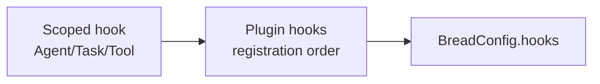

# Agents

An agent is a folder under `agents/<id>/`. The only required file is `agent.ts`, which default-exports
a `defineAgent({...})` call. Everything else (`prompt.md`, `tools/`, `skills/`, `evals/`) is optional
and discovered by convention.

```ts
// agents/writer/agent.ts
import { defineAgent } from '@breadai/core'
import { z } from 'zod'

export default defineAgent({
  model: { provider: 'anthropic', model: 'claude-opus-4-8' },
  inputSchema: z.object({ topic: z.string() }),
  outputSchema: z.string(),
  output: { format: 'markdown' },
  steps: { max: 10 },
})
```

## `AgentConfig` reference

| Field | Type | Purpose |
|-------|------|---------|
| `model` | `{ provider, model }` | Provider key + model id. See [providers](#providers). |
| `providers?` | `ProviderRegistry` | Per-agent named provider instances, checked before the global `BreadConfig.providers` on a name collision. See [providers](#providers). |
| `inputSchema` | `z.ZodType` | Validates run input. |
| `outputSchema` | `z.ZodType` | The output's real type. Model-enforced for `json` (via `generateObject`); for `text`/`markdown`, only `z.ZodType<string>` type-checks — a `CustomFormat` is the one path to a non-string output derived from streamed text. |
| `output.format` | `'text' \| 'json' \| 'markdown' \| CustomFormat` | `json` switches to structured generation (no tool access). `text`/`markdown` stream raw text — `outputSchema` must resolve to `string`. `CustomFormat` (`{ name, parse(raw) => O }`) streams text like `text` (tools allowed) but reshapes it into a non-string `O` afterward. |
| `permissions?` | `{ allow?, ask?, deny? }` | Selector lists gating the agent's tools — see [Permissions](#permissions). |
| `steps?` | `{ max }` | Max tool-call steps per run (default 20). |
| `knowledge?` | `{ autoInject, maxTokens }` | Auto-inject KG context — see [skills/store]. |
| `documents?` | `{}` | Attach the `core_doc_*` tools (requires a store with document support). |
| `tasks?` | `string[]` | Ids of one-shot tasks to expose as tools, resolved from the task registry — see [tasks.md](./tasks.md). |
| `plugins?` | `Record<string, unknown>` | Opaque, per-plugin agent config, keyed by plugin name — e.g. `{ mcp_client: { servers: [...] } }`. Core never inspects the contents; see [mcp-client.md](./mcp-client.md) for the leading example. |
| `supervisor?` | `{ max?, agents }` | Inject the `core_delegate` tool: the model delegates to sub-agents at runtime — see [pipelines.md](./pipelines.md#supervisors). |
| `loop?` | `{ pool, maxIterations, hooks?, errorHandling? }` | Inject the `core_start_loop` / `core_iterate_loop` / `core_finish_loop` tools: the model composes a pipeline from `pool` and re-runs it until satisfied — see [loops.md](./loops.md). |
| `errorHandling?` | `{ retry }` | Bounds `onError`'s `retry` action — see [Hooks](#hooks). |
| `hooks?` | `Partial<AgentHooks>` | `beforeRun` / `afterRun` / `onError` / `onSuspend` — see [Hooks](#hooks). |

`prompt.md` next to `agent.ts` becomes the system prompt.

## Permissions

`permissions.{allow,ask,deny}` are lists of **selectors** deciding which of the agent's assembled
tools it may call. Resolution is `(allow ∪ ask) − deny`: `deny` beats everything, `ask` beats
`allow` (a tool in both is gated, not free), and an unset/empty `allow` means "all tools".
Human tools are exempt and may not appear in any list.

Every tool carries a structured origin — its scope, an optional sub-id (the skill or plugin that
contributed it), and its name. Selectors address that origin:

| Scope | Selector | Matches | Model-facing leaf |
|-------|----------|---------|--------------------|
| `tool` | `tool:web_search` | an agent's own tool | `tool_web_search` |
| `skill` | `skill:deep_research/cite` | a skill's script tool | `skill_deep_research_cite` |
| `task` | `task:doc_extract` | a one-shot task tool | `task_doc_extract` |
| `plugin` | `plugin:mcp_client/fs__read` | any plugin-contributed tool | `plugin_mcp_client_fs__read` |
| `core` | `core:doc_ingest` | built-ins (`core_doc_*`, `core_kg_*`, loop tools, `core_load_skill`) | `core_doc_ingest` |
| `human` | — not targetable — | HITL tools, always available | `human_approve` |

A full `*` globs one segment: `plugin:mcp_client/*`, `skill:*`, `core:*`. A segment may also embed
`*` as a partial glob — `tool:read_*`, `plugin:mcp_*/read_*`, `tool:get_*_by_id` — each `*` matching
zero or more `[a-z0-9_]` characters. Bare `*` is not a selector, and an unknown scope or malformed
segment **fails at config load** (`INVALID_PERMISSION`) — a typo'd deny must break the boot, not
silently allow. All names are lowercase snake_case (`INVALID_NAME` otherwise). The `leafName` /
`permId` helpers exported from `@breadai/core` compute a tool's model-facing name and its selector
id from an origin, for building permission lists programmatically.

```ts
permissions: {
  allow: ['tool:*', 'core:doc_ingest'],   // omit allow → all tools
  ask:   ['plugin:mcp_client/*'],         // require human approval per call
  deny:  ['tool:delete_everything'],      // wins over both
}
```

An `ask`-gated tool suspends the run instead of executing: the stream ends with a
`human:required` crumb (`kind: 'approval'`) carrying the pending call, and
`resume(checkpointId, { approved: true | false })` executes or rejects it — the same replayed
resume path as HITL input (see [hitl.md](./hitl.md)).

## Providers

Core has no built-in providers of its own — `model.provider` resolves against named instances
registered in `providers` (`BreadConfig.providers`, global) or an agent's own `providers`
(`AgentConfig.providers`, checked first, wins on a name collision). See [providers.md](./providers.md)
for the built-in catalog, writing your own factories, and resolution/error behavior.

## Output modes

`bread.run()` returns an async iterable of crumbs by default, or a resolved value with `mode: 'sync'`:

```ts
const text = await bread.run('writer', { topic: 'bread' }, { mode: 'sync' })

for await (const crumb of bread.run('writer', { topic: 'bread' })) {
  if (crumb.type === 'text:delta') process.stdout.write(crumb.delta)
}
```

## Cancellation

`run`/`resume`/`runPipeline` all take an optional `signal: AbortSignal`. Aborting stops the
in-flight model call (and any tool that itself checks `ToolContext.signal`, e.g. a task tool's own
model call — delegated sub-agent runs observe the same signal through `runAgent`); a parallel
pipeline fan-out's in-flight branches settle on their own once their model call observes it. A cancelled run
surfaces as an `agent:error` crumb carrying a `BreadError` with code `RUN_CANCELLED`, then rejects —
same as any other run failure, no new crumb type.

```ts
const controller = new AbortController()
const run = bread.run('writer', { topic: 'bread' }, { signal: controller.signal })
setTimeout(() => controller.abort(), 5000) // give up after 5s

for await (const crumb of run) {
  /* ... */
}
```

Bread cannot force a non-cooperative tool's `execute()` to stop — it can only offer the signal.

## Error handling

```ts
defineAgent({
  // …
  errorHandling: {
    retry: { attempts: 3, backoffMs: 500, backoffMultiplier: 2 },
  },
})
```

`retry` bounds how many times `onError`'s `retry` action (see below) re-attempts the failing
operation, with exponential backoff between attempts. Recovering a failed run without retrying —
what `errorHandling.fallback` used to do — is now `onError`'s `recover` action.

## Hooks

Every scope (global, agent, task, tool) shares one hook shape — `beforeRun` / `afterRun` /
`onError` — differing only in what input/output/context each closes over. **Loops** are the one
exception: their lifecycle (start → N iterations → finish) doesn't fit an input/output shape, so
`LoopHooks` uses its own bespoke methods — see [loops.md](./loops.md#hooks).

```ts
interface RunHooks<TInput, TOutput, TCtx> {
  beforeRun(ctx: TCtx & { input: TInput }): BeforeRunResult<TInput, TOutput> | void | Promise<...>
  afterRun(ctx: TCtx & { input: TInput; output: TOutput; durationMs: number }): AfterRunResult<TOutput> | Promise<...>
  onError(ctx: TCtx & { input: TInput; error: BreadError }): OnErrorResult<TOutput> | Promise<...>
}
```

- **`AgentHooks`** = `RunHooks<unknown, unknown, RunContext>` plus `onSuspend` (see below) — set via
  `AgentConfig.hooks`.
- **`BreadHooks`** = `RunHooks<unknown, unknown, GlobalHookContext>` plus `onSuspend` — set via
  `BreadConfig.hooks`, and fires for **every** scope (agent, task, and tool runs alike), not just
  agent runs. `GlobalHookContext` is a discriminated union (`{ scope: 'agent' } & RunContext | {
  scope: 'task' } & TaskRunContext | { scope: 'tool' } & ToolRunContext`) so a global hook can
  narrow on `ctx.scope` to know what kind of run it's observing.
- **`TaskHooks`** / **`ToolHooks`** — see [tasks.md](./tasks.md#hooks) / [tools.md](./tools.md#hooks).
- A plugin can also contribute `hooks?: Partial<BreadHooks>` — see [plugins.md](./plugins.md).

### Chain order

Every run resolves its hooks in the same order: **scoped hook → plugin-contributed hooks (in
`config.plugins` registration order) → `BreadConfig.hooks`.**



- **`beforeRun`** — the first hook to short-circuit stops the chain; an override feeds forward as
  the `input` the next hook sees.
- **`afterRun`** — every hook runs in sequence; each may replace `output`, feeding forward.
- **`onError`** — the first hook to return a non-void resolution stops the chain and is honored
  immediately.
- **`onSuspend`** — observe-only; every hook in the chain always runs, in order.
- A hook throwing propagates immediately and stops that chain (it does not additionally invoke
  `onError` — a bug in a hook is a different failure from a run failure).

### `beforeRun`

```ts
type BeforeRunResult<TInput, TOutput> =
  | { action: 'continue'; input: TInput }   // override the input; void/undefined = no override
  | { action: 'shortCircuit'; output: TOutput }  // end the run now with this output
```

A short-circuit still produces a normal completion — the input/output are persisted to session
history and `afterRun` still fires — it just skips the model call (and with it any delegation)
entirely.

### `afterRun`

```ts
type AfterRunResult<TOutput> = { output: TOutput } | void
```

Returning `{ output }` replaces the run's output before it's returned/persisted; `void` leaves it
unchanged. Chains the same way as `beforeRun`: each hook's replacement feeds forward as the
`output` the next hook sees.

### `onError`

```ts
type OnErrorResult<TOutput> =
  | { action: 'recover'; output: TOutput }        // use this output, skip retry, run afterRun
  | { action: 'retry' }                            // retry now (see below)
  | { action: 'fail'; error: BreadError }          // propagate this error instead, right now
  | void                                            // no opinion — defer to the next hook / the retry default
```

If **every** hook in the chain returns `void`, the runner applies a default: retry if
`errorHandling.retry` is configured and attempts remain, otherwise propagate the original error.
So `errorHandling.retry` makes retrying the *default* outcome of an unhandled error; a hook
explicitly returning `fail` is how you override that default and force immediate failure even
though retry is configured.

`retry` (whether chosen by a hook or by the default above) re-invokes the failing operation with
backoff, and each failed attempt re-enters the `onError` chain fresh — it isn't a silent loop.
Once `errorHandling.retry.attempts` is exhausted, the last error propagates regardless of what any
hook returns on that final pass. A hook returning `retry` with no `errorHandling.retry` configured
at all performs exactly one immediate (no-backoff) retry, not an error.

### `onSuspend`

Agent/Bread scope only (tasks and tools never suspend for HITL). Fires whenever a run suspends for
a human or ask-gated tool call — alongside, not instead of, the existing per-call
`RunOptions.onHumanRequired` callback, which serves a different purpose (handing the checkpoint id
back to the specific caller of that one `run()`, e.g. for an HTTP response).

### Known limitations

- **A tool's own failures don't reach Agent-scope `onError`** — they're resolved (or not) by
  [Tool scope's own `onError`](./tools.md#hooks) first; only errors in the agent's own
  orchestration (resolving the model, the `generateObject`/`streamText` call itself) reach this
  scope's `onError`.
- **Agent-lookup failures** (`AGENT_NOT_FOUND`, thrown before an agent's config is even resolved)
  are not covered by any `onError` chain — these are thrown before hooks are relevant. Delegation
  failures (`core_delegate`) go through the tool `onError` chain like any tool, except a
  `DELEGATION_SUSPENDED` chain-suspension, which is a suspension rather than an error and bypasses
  `onError`/retry entirely.
- **Remote-agent runs** (`BreadConfig.remoteAgents`) bypass hooks entirely, consistent with them
  already bypassing local session persistence.
