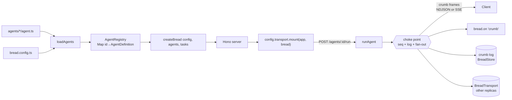
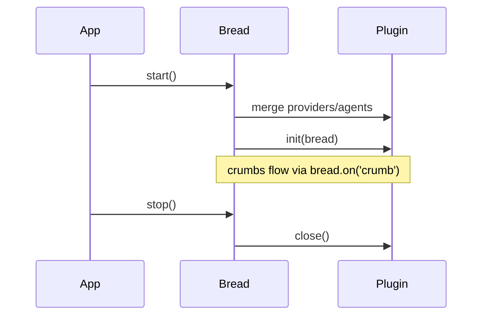

# Architecture

bread turns a directory of agent folders into a running, observable HTTP service. This page maps
the moving parts.

## Packages

| Package | Responsibility |
|---------|----------------|
| `@bread/core` | SDK: `defineAgent`/`defineTool`/…, the runner, sessions, KG/documents, checkpoints, plugins, types |
| `@bread/server` | File-system loader + Hono server (importable library) |
| `@bread/cli` | The `bread` binary |
| `@bread/store-postgres`, `@bread/store-sqlite`, `@bread/store-memory` | `BreadStore` backends — see [store.md](./store.md) |
| `@bread/provider-catalog` | The 18 built-in `@ai-sdk/*` providers as a `ProviderRegistry` — see [agents.md#providers](./agents.md#providers) |
| `@bread/otel`, `@bread/protocol-ag-ui`, `@bread/protocol-a2a-server`, `@bread/a2ui`, `@bread/protocol-mcp-client`, `@bread/protocol-mcp-server` | Plugins |
| `@bread/auth-api-key`, `@bread/auth-jwt`, `@bread/auth-oauth2` | Standalone `BreadAuthStrategy`/`BreadSigner` factories — not plugins themselves; wrap with `@bread/server`'s `authPlugin()` to attach — see [auth.md](./auth.md) |
| `@bread/transport-http-chunked`, `@bread/transport-http-sse` | HTTP ingress `BreadTransport`s — `mount()` the four streaming routes + `remoteAgent()` for `config.remoteAgents` (`transports/http-chunked`, `transports/http-sse`) — see [transports.md](./transports.md) |
| `@bread/transport-redis` | Redis Streams `BreadTransport` — cross-replica crumb fan-out, no `mount` (`transports/redis`) |
| `@bread/transport-stdout` | Terminal-rendering `BreadTransport` (`sink`) for `bread chat`/`bread invoke` (`transports/stdout`) |

## Package families

Beyond `packages/*` (core/server/cli), everything installable lives in one of five workspace
folders, each with its own `@bread/*` npm prefix:

| Folder | npm packages | Covers |
|--------|--------------|--------|
| `stores/` | `@bread/store-postgres`, `@bread/store-sqlite`, `@bread/store-memory` | `BreadStore` backends — see [store.md](./store.md) |
| `providers/` | `@bread/provider-catalog` | Model-provider registries — see [providers.md](./providers.md) |
| `protocols/` | `@bread/protocol-ag-ui`, `@bread/protocol-a2a-server`, `@bread/protocol-mcp-client`, `@bread/protocol-mcp-server` | Wire-protocol adapters (`BreadPlugin`s) |
| `extensions/` | `@bread/otel`, `@bread/a2ui` (attach as `BreadPlugin`s); `@bread/auth-api-key`, `@bread/auth-jwt`, `@bread/auth-oauth2` (standalone auth factories, see [auth.md](./auth.md)) | Observability, UI generation, auth strategies/signers |
| `transports/` | `@bread/transport-http-chunked`, `@bread/transport-http-sse`, `@bread/transport-redis`, `@bread/transport-stdout` | `BreadTransport` implementations — see [transports.md](./transports.md) |

Protocols and most extensions plug in through the same `BreadPlugin` mechanism (see
[plugins.md](./plugins.md)) — the folder split is a naming/discovery convention, not a second
plugin system. The three `@bread/auth-*` extensions are the one exception: they're standalone
`BreadAuthStrategy`/`BreadSigner` factories, not `BreadPlugin`s — see [auth.md](./auth.md).

## From folder to running service

The loader reads each `agents/<id>/` folder, attaches `prompt.md`, `tools/`, and `skills/`
metadata onto the agent's config as private fields (`_systemPrompt`, `_tools`, `_humanTools`,
`_skills`, `_agentDir`), and builds an **`AgentRegistry`** (`Map<string, AgentDefinition>`).
`createBread(config, agents, tasks)` returns a `BreadInstance`; the server wraps it.

## One crumb stream: the choke point

Every public stream (`run`, `resume`, `runPipeline`, sync mode) passes through one per-run
**choke point** inside the instance. As each crumb is yielded it gets its per-run monotonic
`seq`, is appended to the durable **crumb log** (`text:delta`s aggregated into windows), reaches
local `bread.on('crumb'/'human:required')` listeners, and is published to the **transport**
(`config.transport` — the embedded Stream by default, `@bread/transport-redis` for multi-replica
deployments). Nothing below the choke point emits anywhere, so the plugin view, the transport
view, the log, and the NDJSON stream are the same well-defined stream. The store is truth
(replay/`Last-Event-ID` catch-up); the transport is liveness. See [transports.md](./transports.md).

## Crumbs

A run is a stream of typed **crumbs** (the project lexicon — Crumb, Plugin — is defined
in the [glossary](./glossary.md)):

`agent:run:start` · `text:delta` · `reasoning:delta` · `file:generated` · `tool:call` ·
`tool:input:start` · `tool:input:delta` · `tool:input:end` · `tool:result` · `tool:result:partial` ·
`tool:error` · `human:required` · `human:resumed` · `subagent:run:start` · `subagent:run:end` ·
`pipeline:step:start` · `pipeline:step:end` · `loop:start` · `loop:iteration:start` ·
`loop:iteration:end` · `loop:end` · `task:start` · `task:end` · `agent:run:end` · `agent:error`.

A run that calls a human tool ends its stream at `human:required`; [`resume`](./hitl.md) replays it
from the store and returns the continuation starting with `human:resumed`.

## The public instance surface

Ingresses (the HTTP server, `@bread/protocol-mcp-server`, or your own) consume only the public
`BreadInstance` API: `run` / `resume` / `runPipeline` / `runTask`, the `bus` and `store`
getters, and the `agents` / `tasks` / `pluginTools` / `credentials` registries. The internal
`RunnerContext` is exactly that — internal (`@internal` export for the CLI loader and tests
only). See the "bring your own ingress" guide in [transports.md](./transports.md).

## Plugin lifecycle

See [plugins.md](./plugins.md) for the `BreadPlugin` interface.

## Storage

All state — sessions, HITL checkpoints, the knowledge graph, documents, and task-run audit records —
persists through a single **`BreadStore`** interface, set as `config.store`. PostgreSQL is the recommended backend
(`@bread/store-postgres`'s `store()` reads `DATABASE_URL` itself); SQLite (`@bread/store-sqlite`, `bun:sqlite`) and
in-memory implementations ship as alternatives, and any custom backend can be passed as `store`. Neither core nor
the CLI bundles a driver, and nothing is wired implicitly — an unset `store` throws
`STORE_NOT_CONFIGURED`. See [store.md](./store.md).
