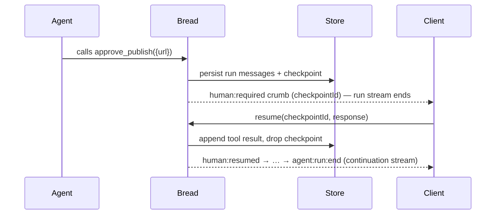

# Human-in-the-loop (HITL)

A human tool pauses a run until a person responds. Define one with `defineHumanTool`, and the run
suspends when the agent calls it.

## Flow



1. Drop `defineHumanTool('approve_publish', schema)` in `agents/<id>/tools/`.
2. When the agent calls it, bread persists the run's messages and a **checkpoint**, then emits a
   `human:required` crumb carrying `checkpointId`, `toolName`, and the args schema. **The run stream
   ends here** — there is no live generator left waiting.
3. The client resumes: `bread.resume(checkpointId, response)` (or `POST /resume/:checkpointId
   { "response": ... }`). Bread appends the answer as the tool's result and **replays the run from
   the store**, returning the continuation as a fresh crumb stream.

```ts
// tool
export default defineHumanTool('approve_publish', z.object({ url: z.string() }))

// client — the run stream ends at human:required; resume returns the continuation stream
for await (const crumb of bread.run('publisher', input)) {
  if (crumb.type === 'human:required') {
    for await (const c of bread.resume(crumb.checkpointId, { approved: true })) {
      // c: human:resumed → text:delta … → agent:run:end
    }
  }
}
```

From the terminal, [`bread chat`](./cli.md#chat) drives this loop for you: it prompts when a
run hits a human tool and consumes the continuation stream with your answer. `bread invoke` is
non-interactive and refuses such runs rather than hanging.

## Persistence and restart-safe resume

When a run suspends, both the run's messages and the checkpoint are persisted to the store in one
atomic write, so pending checkpoints stay listable via `store.listCheckpoints()` across a restart —
no in-memory rehydration step involved. Resume does **not** depend on a live in-memory run
generator: it reconstructs the run from the persisted session history — the assistant message
holding the pending tool-call plus the freshly appended tool result — and replays it forward. That
means resume works **after a server restart** and from **a different process or container** than
the one that started the run, as long as they share the store. If the suspending run passed
`{ skill: '...' }`, that skill is recorded on the checkpoint and reapplied on resume, so a HITL
suspend never silently drops a skill's tools or system-prompt contribution.

Replay only continues forward: tools that already ran are persisted as tool-result messages and are
**not** re-executed, so there is no double-side-effect risk.

Resume atomically claims the checkpoint before doing anything else: if two `resume()` calls race for
the same `checkpointId` (a retried request, a double-click), only one wins and proceeds — the other
gets `CHECKPOINT_NOT_FOUND` instead of also executing an approval-gated tool or appending a duplicate
result. A checkpoint is deleted along with its session if that session is deleted or reaped by
`cleanupSessions`, so a resume can never land against a session that no longer exists.

Passive observers are covered too: `GET /runs/:runId/stream` stays open across `human:required`,
so a subscriber on container B keeps listening while the run is suspended — when the resume lands
on container A, the continuation flows A → transport → B (with a distributed `config.transport`;
the embedded Stream default covers single-container deployments). See
[http-api.md](./http-api.md#get-runsrunidstream).

## HITL inside a composition

Suspension is durable through [pipelines and supervisors](./pipelines.md) too — the same
restart-safe guarantee, extended by **checkpoint linkage** (`CheckpointRecord.parent`):

- **Pipeline**: a step's agent suspending stops the pipeline; the checkpoint carries the remaining
  steps (self-contained — this also covers dynamically composed pipelines, e.g.
  [loop](./loops.md) iterations). Resuming the agent closes the suspended step and runs the rest
  of the pipeline in the same continuation stream. A suspended `parallel` branch surfaces its
  `human:required` only after every sibling settles (so the linkage is complete before anyone can
  resume); each branch's resume fills its slot, and the **last** one carries the merged output into
  the remaining steps.
- **Supervisor delegation**: a delegated run suspending chain-suspends the supervisor — its turn
  persists with the `core_delegate` call left dangling, and a supervisor checkpoint lists the
  pending delegation(s). Resuming the **child** cascades: the child completes, its output lands as
  the supervisor's tool result, and — once no delegations remain pending — the supervisor run
  continues, composes, and hands its own output up to *its* parent if it has one (supervisor inside
  a pipeline, delegation chains). The supervisor's checkpoint itself is not directly resumable
  (`SUPERVISOR_CHECKPOINT_NOT_RESUMABLE` names the child checkpoints to resume instead).

In both shapes the client-facing contract is unchanged: the stream ends at `human:required`, and
`resume(checkpointId, response)` — always aimed at the suspended agent's own checkpoint — returns
one continuation stream that runs as deep as the composition goes. Concurrent resumes of *sibling*
suspensions (two parallel branches, two delegations) are supported sequentially; resuming them
simultaneously from different processes may race their merge bookkeeping.
