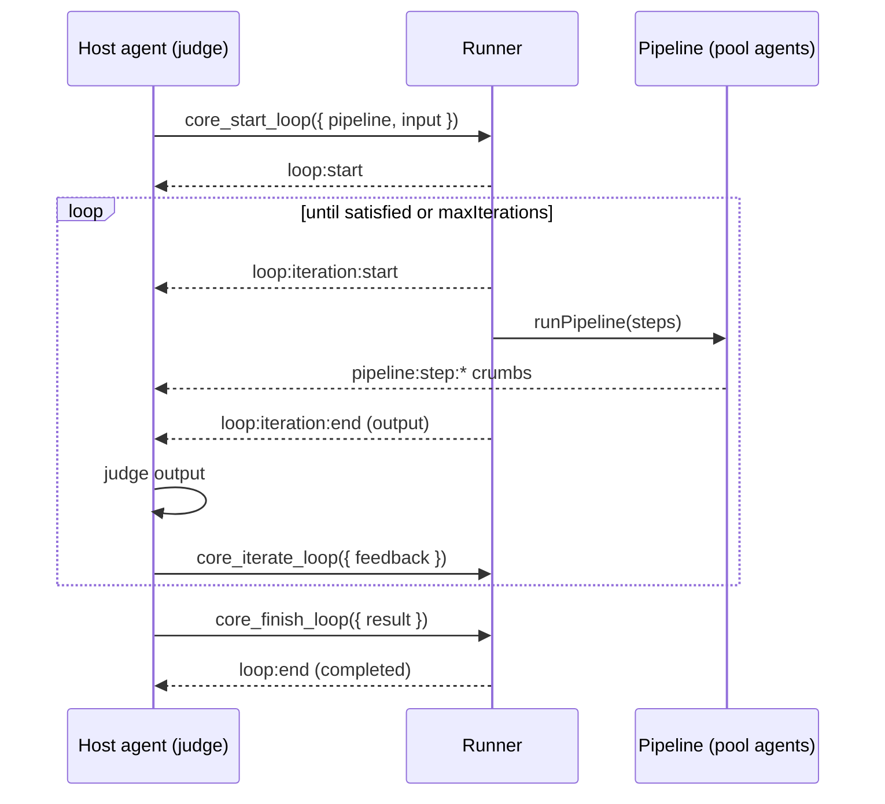

# Agent-driven loops

A **loop** lets an agent iterate over a pipeline it composes at runtime — running it, judging the
output, and re-running the **same** pipeline until it is satisfied or a consumer-set cap is reached.

Unlike a [pipeline](./pipelines.md), whose shape is declared at config time, a loop is **driven by
the host agent at runtime through tools** — like a [supervisor](./pipelines.md#supervisors), but
where a supervisor routes work, a loop *repeats* it. The consumer only supplies a *pool* of agents
the host may use and a hard `maxIterations` cap; the host agent decides which agents to compose, when
to iterate, and when it is done.

## Configure

Add a `loop` block to the agent. It gates the feature and bounds it — when present, the runner injects
the `core_start_loop` / `core_iterate_loop` / `core_finish_loop` tools and tells the model about its pool.

```ts
defineAgent({
  model: { provider: 'anthropic', model: 'claude-opus-4-8' },
  inputSchema: z.string(),
  outputSchema: z.string(),
  output: { format: 'text' },
  loop: {
    pool: ['researcher', 'drafter', 'critic'], // agents the host may compose into a pipeline
    maxIterations: 10,                          // hard cap — consumer-owned, never agent-chosen
  },
})
```

The host agent itself may appear in its own `pool` (it can be a step in the pipeline it composes).

## Tools

| Tool | Args | Behaviour |
|------|------|-----------|
| `core_start_loop` | `pipeline: string[]`, `input?` | Validate every id is in the pool and registered, then run the composed pipeline once. Returns `{ loopId, iteration, maxIterations, canIterate, output }`. |
| `core_iterate_loop` | `feedback?` | Re-run the **same** pipeline. With `feedback`, the next input is `{ previousOutput, feedback }`; otherwise the previous output is passed straight through. |
| `core_finish_loop` | `result?` | Close the loop, recording the final judged result (defaults to the last output). |

`pipeline` is a sequential list of agent ids (it may be a single agent). Each iteration runs them in
order, each step's output feeding the next — the same engine as [pipelines](./pipelines.md).

### Completion

- **Satisfied** → the host calls `core_finish_loop`; status becomes `completed`.
- **Cap reached** → `core_iterate_loop` past `maxIterations` closes the loop as `exhausted` (the last output
  is recorded as the result); no further `core_finish_loop` is needed.
- **Run ends / errors with a loop still open** → the runner closes it as `completed` (last output) or
  `failed`.

## Lifecycle



## Crumbs

Loop activity streams live on the agent run's SSE stream alongside the usual crumbs:

| Crumb | Fields |
|-------|--------|
| `loop:start` | `loopId, pipeline, maxIterations` |
| `loop:iteration:start` | `loopId, iteration` |
| `loop:iteration:end` | `loopId, iteration, output` |
| `loop:end` | `loopId, status, iterations, result?` (`status`: `completed` \| `exhausted` \| `failed`) |

The [ag-ui](./plugins.md) plugin maps these to `STATE_SNAPSHOT` events and a2ui to `progress`
components.

## Hooks

A loop's lifecycle (start → N iterations → finish) doesn't fit the `beforeRun`/`afterRun`/`onError`
shape every other scope shares (see [agents.md#hooks](./agents.md#hooks)) — so `LoopConfig.hooks?:
Partial<LoopHooks>` uses its own methods instead, one per lifecycle point above:

| Method | Fires | Notes |
|--------|-------|-------|
| `onInit(ctx)` | Right after `loop:start`, once. | `{ loopId, pipeline, maxIterations }` |
| `onIterationStart(ctx)` | Right after `loop:iteration:start`, once per iteration (not re-fired on retry). | `{ loopId, iteration, input }` |
| `onIterationEnd(ctx)` | Before `loop:iteration:end`. May return `{ output }` to replace that iteration's result — the replacement becomes `lastOutput` and what the tool caller sees; the persisted iteration row and crumb still show the raw pipeline output. | `{ loopId, iteration, output }` |
| `onError(ctx)` | On a thrown error from the iteration's pipeline. Same `recover` / `retry` / `fail` / `void` resolution as every other scope's `onError`, bounded by `LoopConfig.errorHandling.retry` — `recover` substitutes that iteration's output and the loop continues, `retry` re-runs just that iteration. | `{ loopId, iteration, error }` |
| `onFinish(ctx)` | Alongside every `loop:end` (satisfied, cap reached, or run ends/errors with a loop still open). | `{ loopId, status, iterations }` |

Unlike Agent/Task/Tool, `LoopHooks` is **not** part of the scoped → plugin → global chain — it's a
standalone, loop-config-only hook family (`config.plugins`/`BreadConfig.hooks` don't apply here).
Note that `core_start_loop`/`core_iterate_loop`/`core_finish_loop` are themselves tools, so they
also pass through [Tool scope's](./tools.md#hooks) own hook/crumb handling on the way out — that's
a separate, outer layer from `LoopHooks`.

## Inspecting loops

Loops are persisted to the [store](./store.md) (`bread_loops` + `bread_loop_iterations`) and exposed
read-only for reporting:

```bash
curl localhost:3000/loops                 # list; ?session= ?agent= ?status= to filter
curl localhost:3000/loops/<loopId>        # { loop, iterations[] }
```

Each iteration row keeps its `input`, `output`, and timing, so a frontend can replay the full
judge-and-iterate history.
