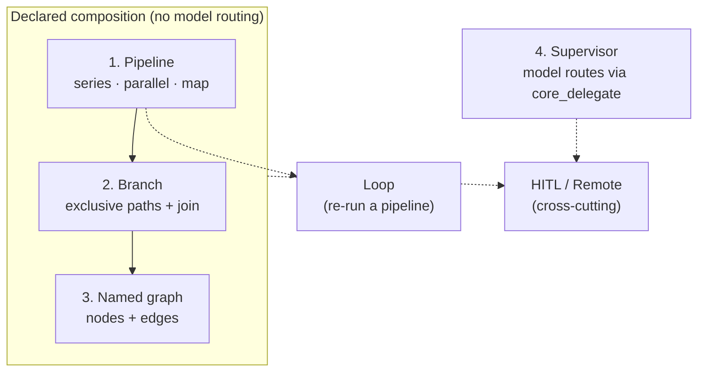

# Pipeline → graph (proposed)

> **Status:** proposed. Docs-only. No runtime behaviour changes in this PR.
> Implementation follows this page. Until then, [pipelines.md](./pipelines.md) is the live contract.

This page defines how bread grows from today's **pipeline** (a fixed series / parallel / map recipe) toward a **workflow graph** (declared conditional paths), without blurring the line with **supervisor** (model routes at runtime).

## Why this exists

Industry “agent graph” talk usually mixes three different decisions:

1. **What is declared ahead of time** (edges you can read in config).
2. **What the model decides at runtime** (routing, retries, when to stop).
3. **Where a human pauses the run** (HITL).

bread keeps those decisions in different shapes. A pipeline is not a full workflow graph yet: it has no **declared conditional branch**. Supervisor covers the *dynamic* fork today. Declared branches are the gap this spec closes — still without putting model routing into the declared graph.

## The four layers

| Layer | Name | Declared? | Model IQ in the composition? | Status |
|---|---|---|---|---|
| 1 | **Pipeline** | Yes — `pipelines:` steps | None | **Shipped** |
| 2 | **Branch** | Yes — exclusive paths on prior output | None (predicate is data / expression, not a free agent turn) | **Proposed** |
| 3 | **Named graph** | Yes — named nodes + edges | None | **Later** |
| 4 | **Boundary: Supervisor** | Roster on the agent | Yes — `core_delegate` | **Shipped** (and stays separate) |

Layers 1–3 are successive **declared** composition. Layer 4 is the hard product boundary: if the model chooses the next agent, that is a supervisor (or a loop's judge), never a pipeline edge.

Orthogonal (already shipped, apply inside any layer):

- **Loop** — model repeats a pipeline until satisfied ([loops.md](./loops.md)).
- **HITL** — human pause; durable suspend/resume ([hitl.md](./hitl.md)).
- **Remote** — same run shape on another machine ([remote-agents.md](./remote-agents.md)).



---

## Layer 1 — Pipeline (shipped; invariants)

**Definition.** A pipeline is an ordered list of steps declared under `pipelines:` in `bread.config.ts`. Each step's output feeds the next. Step types today: `agent`, `parallel`, `map`. See [pipelines.md](./pipelines.md).

**Invariants (must hold after every later layer):**

1. **No composition IQ.** The shape does not change mid-run because a model “felt like” taking another path. Predicates in later layers evaluate data; they do not open a free agent turn that invents edges.
2. **Series-parallel restricted DAG.** Nested `parallel` / `map` may fan out and join; there is still a single forward spine for the outer list. No arbitrary backward edges.
3. **Config is the source of truth.** What runs is what you can read in config (plus schemas), not a transcript of model tool calls.
4. **HITL stops the composition durably.** Same contract as today: suspend at `human:required`, resume continues remaining steps.

**What “graph” means for Layer 1.** Industry shorthand often calls any multi-step agent flow a graph. In bread, Layer 1 is only the **series-parallel** fragment of a DAG — useful, but not a full workflow graph.

---

## Layer 2 — Branch (proposed next)

**Goal.** Add **declared conditional edges**: exclusive paths chosen from the previous step's output, then a join back to a single continuation.

**Non-goals for Layer 2.**

- Named nodes / free topology (that is Layer 3).
- Model-chosen next agent (that is Layer 4 / Supervisor).
- Replacing `parallel` (fan-out where *all* branches run stays `parallel`).

### Shape (illustrative config — not implemented)

Exact field names are fixed at implementation time; behaviour below is normative.

```ts
// illustrative — not live API
{
  type: 'branch',
  // Input to the branch = output of the previous pipeline step.
  on: '$.status',           // path into prior output (JSON-pointer or equivalent)
  cases: [
    { match: 'needs_review', steps: [ /* nested pipeline steps */ ] },
    { match: 'ready',        steps: [ /* ... */ ] },
  ],
  default: { steps: [ /* ... */ ] },  // required unless cases are proven exhaustive
}
```

### Semantics

| Rule | Behaviour |
|---|---|
| **Exclusive** | Exactly one arm runs (`cases` first match, else `default`). Never “run all matching”. |
| **Nested steps** | An arm is a nested step list with the same types as a pipeline (including nested `parallel` / `map` / later `branch`). |
| **Join** | After the chosen arm finishes, its output is the branch step's output and feeds the next outer step. |
| **No model in the predicate** | `on` / `match` evaluate prior **data**. If you need a model to *classify* before branching, put an `agent` step **before** the `branch`, then branch on that agent's structured output. |
| **Failure** | Missing `default` and no match → hard error (fail the run), not silent fall-through. |
| **HITL** | Same as pipeline: suspend in the active arm; resume continues that arm then the outer remainder. |
| **Streaming** | Crumbs from the active arm only; no crumbs from arms not taken. |

### Why this is the next step (not Layer 3 first)

Most “I need a graph” requests are **if / else / switch** on structured output. Branch covers that without inventing a second config language. Named graphs wait until nesting becomes painful.

### Supervisor vs Branch

| | Branch (Layer 2) | Supervisor (Layer 4) |
|---|---|---|
| Who chooses the path? | Declared predicate on data | The model's `core_delegate` calls |
| When is the path known? | Before the run (given inputs) | During the run |
| Auditing | Read config | Read transcript / crumbs |
| Use when | Stable business rules, compliance, deterministic routing | Open-ended “who should handle this?” |

---

## Layer 3 — Named graph (later)

**Goal.** When nested `branch` / `parallel` trees are hard to read or share, allow an explicit **nodes + edges** form that still compiles to the same runtime as Layers 1–2.

**Constraints.**

1. Still a **DAG** (no cycles). Cycles that need model judgment stay **Loop** or Supervisor.
2. Still **no model routing on edges**. An edge condition is data/expression, same rules as Branch.
3. Prefer a **compile-down**: named graph → internal series-parallel + branch tree, so one executor, one HITL/checkpoint story.
4. Node ids are stable in crumbs / OTel for observability.

**Out of scope until needed:** visual editors, importing LangGraph/StateGraph ASTs, weighted edges, probabilistic fan-out.

---

## Layer 4 — Boundary: Supervisor stays separate

**Hard rule.** Declared composition (Layers 1–3) **must not** gain a step type whose job is “ask the model which agent to call next.” That behaviour already exists: configure `supervisor` and use `core_delegate` ([pipelines.md#supervisors](./pipelines.md#supervisors)).

**Allowed patterns.**

- Pipeline / branch / graph **containing** a supervisor agent as a normal `agent` step (the supervisor may delegate internally).
- Supervisor **delegating into** a pipeline run (if/when the product exposes that as a tool) — the pipeline remains declared; the supervisor only chooses *whether/when* to start it.

**Disallowed patterns.**

- `type: 'route'` / `type: 'handoff'` steps that are sugar for free-form model routing inside `pipelines:`.
- Renaming Supervisor to “Graph” or Pipeline to “Graph” in the public API — vocabulary stays literal ([glossary.md](./glossary.md)).

---

## Mapping the orchestration series

For product / content clarity, bread's composition story is:

1. **Pipeline** — fixed series / parallel / map (Layer 1).
2. **Supervisor** — model routes (Layer 4).
3. **Loop** — model repeats a pipeline until satisfied.
4. **HITL** — human pause inside any composition.
5. **Remote** — same shapes, other machine.
6. **Declared branch / workflow graph** — Layers 2–3 (this page).

Do not call Layer 1 a “full graph.” Do not call Supervisor a “pipeline.” Do not call Loop a handoff shape.

---

## Implementation notes (for the code PR that follows)

1. Ship Layer 2 behind the existing `pipelines:` config; extend the step union; keep JSON Schema / Zod validation failing closed on unknown step types.
2. Add unit tests for: match, default, no-match error, nested parallel inside an arm, HITL suspend/resume across a branch, crumb exclusivity.
3. Docs: move this page from **proposed** to **current** in the same PR that lands the runtime; update [pipelines.md](./pipelines.md) with the live `branch` table row.
4. Layer 3 is a separate minor after Layer 2 has real users.
5. No AgentCore / vendor-specific naming in generic composition docs.

## Open questions (resolve in the implementation PR)

1. Predicate language: JSON-path only vs small expression subset vs Zod-refined discriminator on typed prior output.
2. Whether `match` is strict equality only in v1 (recommended) or allows ranges / sets.
3. Whether arms may be empty (pass-through) — recommendation: yes, explicit `{ steps: [] }`.
