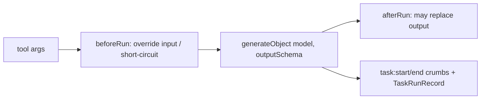

# Tasks

A **task** is a one-shot, stateless unit of work that compiles to an **LLM-callable tool**. It wraps
a single structured model call (`generateObject`) and adds `beforeRun`/`afterRun`/`onError` hooks
for transformations. Unlike an [agent](./agents.md), a task has no tool loop, session, or HITL — it
takes input, runs one model call, and returns a typed object. Agents opt into tasks by listing ids in
`cfg.tasks` — the task-registry equivalent of naming an [MCP server](./mcp-client.md) under
`cfg.plugins.mcp_client`.

Use a task when the work is a bounded transformation (extract, summarize, classify, rewrite) rather
than an open-ended, multi-step conversation. Define it once; reuse it across agents.

## Define a task

A task lives in `tasks/<id>.ts` and is created with `defineTask`. The loader registers it under its
`name` (the tool name the model sees).

```ts
import { defineTask } from '@breadai/core'
import { z } from 'zod'

export default defineTask({
  name: 'doc_extract_entities',          // the tool name exposed to the agent
  description: 'Extract entities from a stored document',
  model: { provider: 'anthropic', model: 'claude-opus-4-8' },
  instructions: 'Extract the named entities. Return each with a short `type`.',
  schema: z.object({ documentId: z.string() }),        // the tool args the model passes
  outputSchema: z.object({                              // the structured model output
    entities: z.array(z.object({ name: z.string(), type: z.string().optional() })),
  }),
  hooks: {
    // args -> model input (e.g. load the document the model should read). The
    // returned input replaces the args entirely — there's no separate "original
    // args" slot, so carry forward anything afterRun will need (documentId here).
    async beforeRun(ctx) {
      const { documentId } = ctx.input
      const doc = await ctx.store.readDocument({ agentId: ctx.agentId, id: documentId })
      return { action: 'continue', input: { documentId, content: doc.content } }
    },
    // model output -> tool result (e.g. persist entities to the knowledge graph)
    async afterRun(ctx) {
      const { documentId } = ctx.input
      for (const e of ctx.output.entities) {
        await ctx.store.addKnowledgeNode?.({ agentId: ctx.agentId, sessionId: ctx.sessionId, label: e.name })
      }
      return { output: { documentId, ...ctx.output } }
    },
  },
  errorHandling: { retry: { attempts: 3 } },
})
```

## Hooks



- **`schema`** validates the args the model passes when it calls the tool (enforced by the runner).
- **`beforeRun(ctx)`** may override `ctx.input` (which becomes the model input) or short-circuit the
  task entirely with a substitute output. `void`/no return = unchanged. See
  [agents.md#hooks](./agents.md#hooks) for the full `beforeRun`/`afterRun`/`onError` contract shared
  by every scope — this is the same shape, just scoped to one task.
- **`generateObject`** runs the model against `outputSchema`, wrapped in `onError`'s
  recover/retry/fail resolution (bounded by this task's own `errorHandling.retry`, same field as
  `AgentConfig.errorHandling`).
- **`afterRun(ctx)`** may replace the final tool result. `void`/no return = unchanged.

`ctx` (a `TaskRunContext`) carries `agentId`, `sessionId`, `runId`, `taskName`, `credentials`, and
the `store`, so a hook can do I/O — load a document, persist [knowledge-graph](./store.md) nodes,
etc. Like every other scope, a task's hooks run first, then any plugin-contributed hooks, then
`BreadConfig.hooks` — see [agents.md#chain-order](./agents.md#chain-order).

## Attach to an agent

List the task `name`s in the agent's `tasks`:

```ts
defineAgent({
  model: { provider: 'anthropic', model: 'claude-opus-4-8' },
  inputSchema: z.string(),
  outputSchema: z.string(),
  output: { format: 'text' },
  tasks: ['doc_extract_entities'],   // resolved from the task registry into tools
})
```

The runner resolves each id from the registry, compiles it with `createTaskTool`, and adds it to the
agent's tool set. An unknown id fails the run with `TASK_NOT_FOUND`.

> Document and knowledge-graph **storage** tools (`core_doc_ingest`, `core_doc_read`, `core_kg_store`, …) are
> separate: they attach automatically when the agent sets `documents` / `knowledge` and the store
> supports them. A task uses the store directly in its hooks; it does not need those tools.

## Observability & audit

Every task invocation is both streamed and recorded:

- **Crumbs** — `task:start` and `task:end` (with `taskRunId`, `taskId`, model, `durationMs`, token
  `usage`, and `status`) flow on the agent run's stream, SSE, and OpenTelemetry (via `@breadai/otel`).
- **Durable audit** — a `TaskRunRecord` (input, output, model, usage, timing, status) is persisted
  via the store's optional `createTaskRun`/`finishTaskRun` methods and queryable after the fact.

```bash
curl localhost:3000/tasks            # list; ?task= ?session= ?agent= ?status= ?limit= to filter
curl localhost:3000/tasks/<id>       # a single task run
```

See [`examples/knowledge-graph`](../examples/knowledge-graph) for a working `doc_extract_entities`
task wired into an agent.
