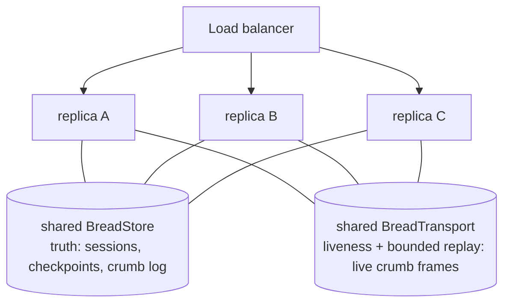

# Transports

"Transport" in bread is **three distinct seams**, not one interface. Each answers a different
question, has its own contract, and scales independently:

| Seam | Question it answers | Direction | Interface | Reference implementation |
|------|--------------------|-----------|-----------|--------------------------|
| **Ingress** | How do callers reach an instance? | outside → instance | the public `BreadInstance` API | `config.transport.mount()` (HTTP), `@breadai/protocol-mcp-server` (MCP) |
| **Remote agents** | How does one bread call agents on *another* bread? | instance → peer | `RemoteAgent` via `config.remoteAgents` | a transport's own `remoteAgent()` |
| **Transport** | How do replicas of the *same* app share live crumbs? | replica ↔ replica | `BreadTransport` via `config.transport` | embedded Stream default; `@breadai/transport-redis` |

The HTTP ingress is no longer `@breadai/server`-owned code: `createServer()` mounts whichever
mount-capable transport `config.transport` names (`config.transport.mount(app, bread)`) —
implemented purely against the public instance surface, the same discipline a fully external
ingress like `@breadai/protocol-mcp-server` already follows. `@breadai/server` itself keeps only what's
genuinely transport-agnostic: auth, plugin routes, and the non-streaming routes (`/agents`
listing, `/sessions*`, `/loops*`, `/tasks*`). Remote agents and transports are **config-level
providers**, like `store`.

## Package map

Every `transports/*` package exports its factory as `transport(opts?): BreadTransport` — identical
name across the family, so swapping which transport backs `config.transport` is a pure
import-source change. The two that can serve as an HTTP ingress also export `remoteAgent(opts):
RemoteAgent`.

| Package | Capability | Exports | Notes |
|---|---|---|---|
| `@breadai/transport-stdout` | `sink` | `transport(opts?)` | Renders crumbs to the terminal for `bread chat`/`bread invoke`. No `mount` — can't serve HTTP ingress. |
| `@breadai/transport-redis` | `duplex` | `transport(opts?)` | Redis Streams cross-replica fan-out. No `mount` — see the known gap below. |
| `@breadai/transport-http-chunked` | `duplex` + `mount` | `transport(opts?)`, `remoteAgent(opts)` | NDJSON (Bread protocol `CrumbFrame` lines). Recommended default. |
| `@breadai/transport-http-sse` | `duplex` + `mount` | `transport(opts?)`, `remoteAgent(opts)` | SSE — browser-`EventSource`-friendly; wire-compatible with bread's original hand-rolled SSE routes. |

## The logical envelope

Every transport moves the same three frame types. They are defined independently of encoding —
HTTP/SSE, MCP, a future JSON-RPC or A2A bridge, and transport messages are all *mappings* of this
one logical protocol.

### Run request

| Field | Type | Meaning |
|-------|------|---------|
| `agentId` | `string` | Agent to run (remote ids in `remoteAgents` shadow local ones) |
| `input` | JSON | Validated by the agent's `inputSchema` |
| `session?` | `{ id?, tags? }` | Attach to / create a session |
| `skill?` | `string` | Caller-driven skill for this run |

### Crumb frame (`BusFrame`)

| Field | Type | Meaning |
|-------|------|---------|
| `runId` | `string` | The run this crumb belongs to |
| `seq` | `number` | Per-run monotonic position in the durable crumb log |
| `crumb` | `BreadCrumb` | Wire-safe crumb (errors flattened to `{ name, code, message, context }`) |

`seq` semantics: durable crumbs own a log position; `text:delta` crumbs carry a **watermark** —
the seq of the last durable entry — because deltas are aggregated before persisting. Delivery is
**at-least-once** with **publish order preserved per `runId`** (no ordering across runs). Clients
dedup on reconnect with the rule: accept durable frames with `seq >` the last replayed id, deltas
with `seq >=` (bounded to one in-flight window of duplication).

### Resume frame

| Field | Type | Meaning |
|-------|------|---------|
| `checkpointId` | `string` | The `human:required` crumb's checkpoint |
| `response` | JSON | Human answer (input tools) or `{ approved }` (ask-gated tools) |

### Mappings

| Envelope | `@breadai/transport-http-chunked` | `@breadai/transport-http-sse` | `@breadai/transport-redis` |
|----------|--------------------------------|------------------------------|--------------------------|
| Run request | `POST /agents/:id/run` body | `POST /agents/:id/run` body | — (execution is ingress-local) |
| Crumb frame | one Bread protocol `CrumbFrame` JSON line per NDJSON chunk | SSE `id: <seq>` + `data: {type, payload}`; catch-up via `Last-Event-ID` on `GET /runs/:runId/stream` | `XADD bread:run:{<runId>} … frame <json>` |
| Resume frame | `POST /resume/:checkpointId` body | `POST /resume/:checkpointId` body | — |

## The Bread protocol

`packages/core/src/protocol.ts` formalizes the wire envelope a **duplex** transport speaks once a
crumb frame crosses a network boundary, reusable for any encoding. `@breadai/transport-http-chunked`
is its reference conformer (NDJSON `CrumbFrame` lines). `@breadai/transport-http-sse` deliberately
does **not** speak it — its SSE `{type, payload}` framing predates this module and is kept
byte-compatible with bread's original hand-rolled SSE routes rather than rewritten onto the
versioned envelope; see that package's own README for the wire-compatibility rationale.

| Frame | Fields | Purpose |
|-------|--------|---------|
| `CrumbFrame` | `{ v, type: 'crumb', runId, seq, crumb }` | One entry of a run's crumb stream — the wire form of `BusFrame` above |
| `SubscribeFrame` | `{ v, type: 'subscribe', runId, afterSeq }` | The catch-up handshake: sent once on (re)connect, asking the peer to replay `seq > afterSeq` before tailing live |

`v` is `BREAD_PROTOCOL_VERSION` (currently `1`) — a frame at an unexpected version is a decode
error, not a silent misparse. `encodeFrame`/`decodeFrame` serialize and validate a frame (crumb
frames flatten/rebuild any live `BreadError` the same way `toWireCrumb`/`fromWireCrumb` do),
throwing `PROTOCOL_DECODE_ERROR` on anything malformed so a transport's read loop has one error
shape to handle.

### The `BreadTransport` contract

Every transport declares a `capability`:

- **`sink`** — publish-only. Nothing subscribes to a sink (`@breadai/transport-stdout` renders crumbs
  to the terminal — there's no "tailing" stdout).
- **`duplex`** — publish **and** `subscribe(runId, afterSeq, handler)`, with a replay guarantee:
  frames with `seq > afterSeq` still within the transport's own retention window are replayed
  before the subscription tails live. Retention is implementation-defined and bounded — this is a
  convenience on top of the store's crumb log, not a replacement for it (a full restart still
  needs the store for durable catch-up). The embedded Stream transport keeps a bounded per-run
  in-memory buffer as its reference implementation.

## One canonical crumb stream

Everything hangs off a single per-run **choke point** inside the instance: as each crumb leaves a
public stream it is assigned its `seq`, appended to the durable **crumb log** (with `text:delta`
aggregation), delivered to local `bread.on('crumb')` listeners, and published to the transport. By
construction, what a plugin sees ≡ what the transport carries ≡ what the log stores ≡ what an SSE
client receives — supervisor visibility filtering, remote-agent relays, and pipeline framing are
all applied upstream.

Division of labour: **the store is truth** (durable, unbounded history, replay, `Last-Event-ID`
catch-up) and **the transport is liveness plus bounded replay** (fan-out of in-flight frames, with
implementation-defined retention — see the capability model above). Trimming a transport's own
retention aggressively is fine; the log is what a full restart falls back on.

## Scaled deployment

N identical containers behind a load balancer; each shares the same `store` and `transport`
config. Runs execute on whichever replica the LB picks; the transport fans crumbs out so passive
streams and HITL work from **any** replica.



Walk-through of the cross-replica HITL flow:

1. `POST /agents/writer/run` lands on **A**; A executes, logging + publishing every crumb.
2. A dashboard opens `GET /runs/:runId/stream` on **B**: B replays the log from the store, then
   follows live frames from the transport.
3. The run suspends at `human:required`. A's POST stream ends; B's passive stream **stays open**.
4. `POST /resume/:checkpointId` lands on **C**: C replays the run from the store and executes the
   continuation, publishing to the transport.
5. B relays the continuation live and closes at `agent:run:end`.

The embedded Stream transport makes the same wiring correct on a single container. Scaling this to
multiple containers needs a `config.transport` that is **both** mount-capable (serves the HTTP
ingress on each replica) **and** shared across replicas (fans crumbs out between them) — see the
known gap below, since no single package in the current family is both today.

### Known gap: Redis fan-out doesn't compose with HTTP ingress

`@breadai/transport-redis`'s `transport()` has no `mount` — it is fan-out-only. `createServer()`
requires `config.transport.mount`, so a `config.transport: transport()` (from `@breadai/transport-redis`)
config cannot serve HTTP ingress on the same slot; conversely, `@breadai/transport-http-chunked`/`-http-sse`'s `transport()`
mounts fine but its pub/sub is in-memory and does not fan out across replicas. **Composing "Redis
fan-out across replicas" with "HTTP ingress on each replica" is out of scope for this package
family today** — `config.transport` is one slot, and no package fills both roles at once. The same
limitation applies to `@breadai/transport-stdout` (a `sink`, so no `mount` either) — it can back
`bread chat`/`bread invoke`, but not `bread dev`/`bread start` on the same config.

## Bring your own ingress

Neither `@breadai/server` nor a transport's `mount()` is a privileged ingress — both compile against
the public `BreadInstance` API alone, and that is a guarantee, not an accident. A custom ingress
(JSON-RPC, gRPC, a queue consumer, …) needs only:

```ts
const bread = createBread(config, agents, tasks)
await bread.start()

bread.run(agentId, input, opts)        // → AsyncIterable<BreadCrumb> (or mode:'sync')
bread.resume(checkpointId, response)   // → continuation stream
bread.runPipeline(pipelineId, input)   // → pipeline stream
bread.runTask(taskId, args)            // → one-shot structured result
bread.transport.subscribe?.(runId, afterSeq, handler)  // live tail (+ bounded replay) of any run
bread.store.getCrumbs?.(runId, opts)   // durable history for catch-up
bread.agents / bread.tasks             // registries, for discovery surfaces
```

Map your protocol's request onto the envelope above, relay crumb frames in your encoding, and
keep the dedup rule for reconnects. `@breadai/protocol-mcp-server` is a second worked example (agents and
tasks exposed as MCP tools).

## Contracts & limits

- **The transport has no durability requirement.** Replay is bounded and implementation-defined,
  aggressive trimming/eviction is expected. If a transport is down, runs still execute and
  persist — only cross-replica *live* fan-out (and its bounded replay) degrades.
- **Execution is pull-driven by the ingress client.** The consumer of the run stream drives the
  generator; an abandoned stream stalls its run. A work-queue/claim execution model (submit a run,
  any replica picks it up) is deliberately **post-0.1** — nothing in these seams precludes it,
  and it will be a separate interface, not a change to `BreadTransport`.
- **Crumb payloads must be JSON-serializable.** The one exception — live `BreadError` instances
  on `tool:error`/`agent:error` — is handled by the wire form (`toWireCrumb`/`fromWireCrumb`).
